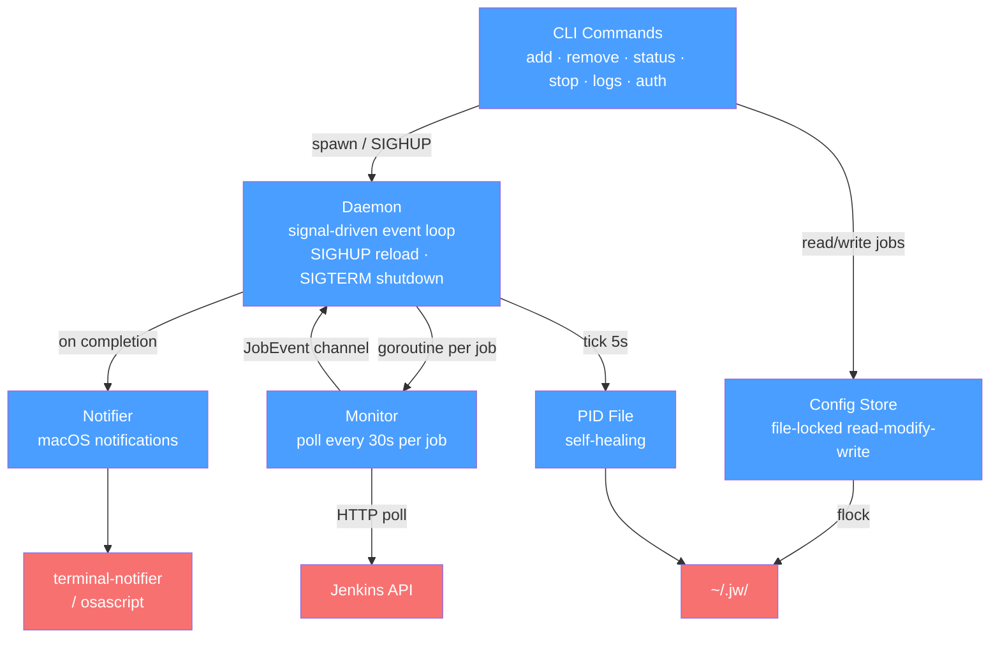

# jw

<p align="center">
  
</p>

A CLI tool that monitors Jenkins jobs in the background and sends macOS notifications when they complete.

## Installation

### Homebrew (Recommended)

```bash
brew install baggiiiie/tap/jw
```

### From Go

```bash
go install github.com/baggiiiie/jw@latest
```

Or build from source:

```bash
go build -o jw .
```

## Usage

Set your Jenkins credentials (same format as `curl -u user:token`):

```bash
export JENKINS_USER=your_username
export JENKINS_API_TOKEN=your_api_token
```

Or use the legacy pre-encoded token:

```bash
export JENKINS_TOKEN=base64_encoded_credentials
```

Add a job to monitor:

```bash
jw add https://jenkins.example.com/job/my-job/123/
```

Check status:

```bash
jw status
```

Other commands:

```bash
jw remove <job_url>   # Stop monitoring a job
jw stop               # Stop the daemon
jw logs               # View daemon logs
jw status --tui       # Interactive TUI
```

## Architecture



## License

MIT
