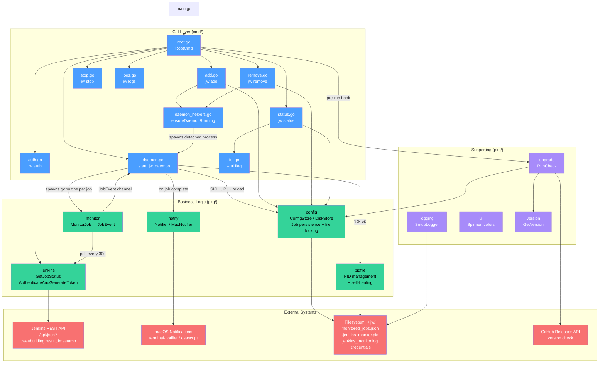

## Architecture

```mermaid
graph TD
    subgraph CLI["CLI Layer (cmd/)"]
        root["root.go<br/>RootCmd"]
        add["add.go<br/>jw add"]
        remove["remove.go<br/>jw remove"]
        status["status.go<br/>jw status"]
        stop["stop.go<br/>jw stop"]
        logs["logs.go<br/>jw logs"]
        auth["auth.go<br/>jw auth"]
        daemon["daemon.go<br/>_start_jw_daemon"]
        tui["tui.go<br/>--tui flag"]
        helpers["daemon_helpers.go<br/>ensureDaemonRunning"]
    end

    subgraph Core["Business Logic (pkg/)"]
        config["config<br/>ConfigStore / DiskStore<br/>Job persistence + file locking"]
        jenkins["jenkins<br/>GetJobStatus<br/>AuthenticateAndGenerateToken"]
        monitorPkg["monitor<br/>MonitorJob → JobEvent"]
        notify["notify<br/>Notifier / MacNotifier"]
        pidfile["pidfile<br/>PID management<br/>+ self-healing"]
    end

    subgraph Support["Supporting (pkg/)"]
        logging["logging<br/>SetupLogger"]
        ui["ui<br/>Spinner, colors"]
        upgrade["upgrade<br/>RunCheck"]
        version["version<br/>GetVersion"]
    end

    subgraph External["External Systems"]
        jenkinsAPI["Jenkins REST API<br/>/api/json?tree=building,result,timestamp"]
        macNotif["macOS Notifications<br/>terminal-notifier / osascript"]
        fs["Filesystem ~/.jw/<br/>monitored_jobs.json<br/>.jenkins_monitor.pid<br/>jenkins_monitor.log<br/>.credentials"]
        gh["GitHub Releases API<br/>version check"]
    end

    main["main.go"] --> root

    root --> add & remove & status & stop & logs & auth & daemon
    status --> tui
    add & remove --> helpers
    helpers -->|"spawns detached process"| daemon

    daemon -->|"spawns goroutine per job"| monitorPkg
    daemon -->|"SIGHUP → reload"| config
    daemon -->|"on job complete"| notify
    daemon -->|"tick 5s"| pidfile

    add & remove & status --> config
    auth --> jenkins

    monitorPkg -->|"poll every 30s"| jenkins
    monitorPkg -->|"JobEvent channel"| daemon

    jenkins --> jenkinsAPI
    notify --> macNotif
    config --> fs
    pidfile --> fs
    logging --> fs
    upgrade --> gh

    root -->|"pre-run hook"| upgrade
    upgrade --> config & version

    classDef cli fill:#4a9eff,color:#fff
    classDef core fill:#34d399,color:#000
    classDef support fill:#a78bfa,color:#fff
    classDef ext fill:#f87171,color:#fff

    class root,add,remove,status,stop,logs,auth,daemon,tui,helpers cli
    class config,jenkins,monitorPkg,notify,pidfile core
    class logging,ui,upgrade,version support
    class jenkinsAPI,macNotif,fs,gh ext
```
